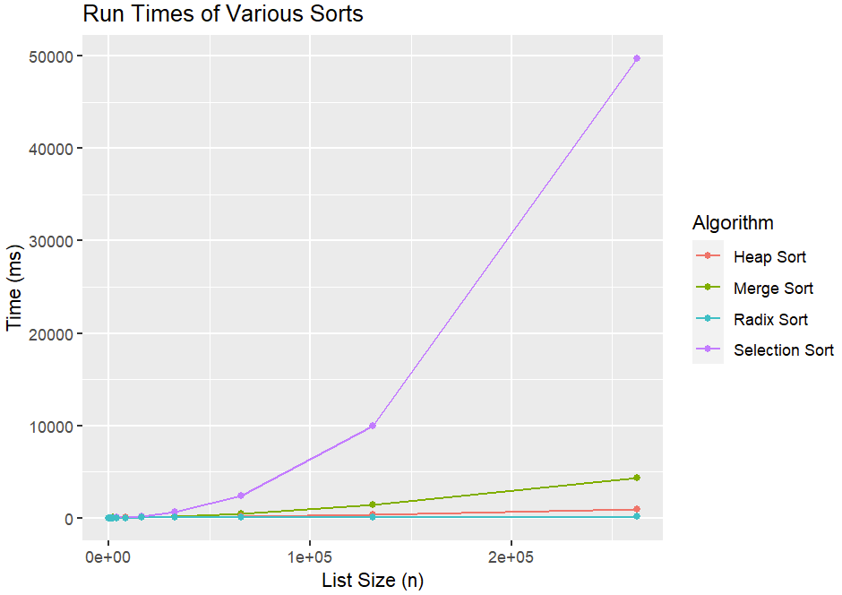
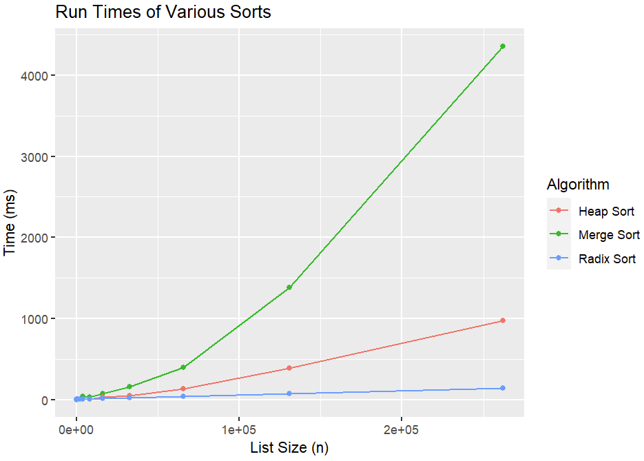

The following report details the process I took to test the performance of the various sorting algorithms I have 
implemented. Graphs are generated using R, as discussed in code blocks.
##### Lists included:
- Selection Sort
- Heap Sort
- Radix Sort
- Merge Sort

This block of code reads the results.csv file and preps it to be made into a graph. Graphs are made using the ggplot2 
library.
```angular2html
library(ggplot2)

results = read.csv("results.csv")
results$Algorithm = as.factor(results$Algorithm)

# Check types in dataframe are correct
str(results)
```
This block of code creates the graph.
```angular2html
runtimes_plot = ggplot(results, aes(x = Size, y = Time, colour = Algorithm)) +
  geom_line() +
  geom_point() +
  ggtitle("Run Times of Various Sorts") +
  xlab("List Size (n)") +
  ylab("Time (ms)")
runtimes_plot
```


Selection sort increases much more as list size increases than the other sorts. We can remove selection sort from the 
graph and reanalyze with more visibility.
```angular2html
results_no_selection = results[results$Algorithm != "Selection Sort",]
runtimes_plot %+% results_no_selection
```


Size of list tested doubles for each run. The analyzer was run 18 times, otherwise it takes too long to run altogether. 
Numbers in lists are randomly generated one after another (allows for duplicates). Average run time is stored for each 
run to be plotted.

The time complexities for the sorts are as follows:
- **Selection Sort:** O(n^2)
- **Heap Sort:** O(n log n)
- **Radix Sort:** O(nd) *n is size of list, d is number of digits in the largest number*
- **Merge Sort:** O(n log n)

Overall, for small list sizes (under 4096 items), all the sorts perform within milliseconds of each other. Best case and
worst case run times do not matter since we are using average run times. For asymptotic behavior, selection sort is much
slower than the other sorts, being exponential, which is can be seen from the graph.
Although theoretically the time complexity for heap and merge sort should be the same, this is not what is plotted on 
the graph. This could be because of the way I implemented the merge sort algorithm. I can further optimize, potentially 
to decrease the overhead of creating two lists for the separate parts or other ways. Heap sort does not have the same 
problem because it's not recursive, so it requires less memory allocation. Merge sort runs slower than heap sort in my 
implementations, and radix sort runs faster than heap sort. Radix sort does appear linear as expected.  